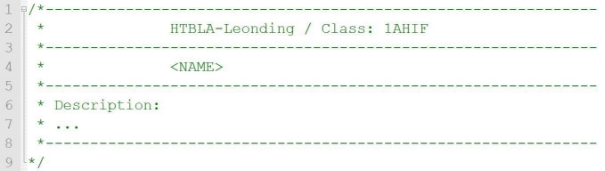

# POSE BussinesCard, 3ABIF/3AKIF

Lehrziele

- Verwendung von Kommentaren
- Die Ausgabe von formatiertem Text auf die Konsole

## Aufgabenstellung

Lesen Sie von der Konsole Name und Wohnort einer Person in zwei Variablen ein und geben Sie danach eine Visitenkarte aus.

**Ausgabe:**

**Erweiterte Ausgabe:**

**Hinweis:**

Fügen Sie einen Blockkommentar am Beginn Ihrer Quellcodedatei ein, die Schule, Klasse, Ihren Namen und eine Kurzbeschreibung Ihres Programms enthält:

Dieser Blockkommentar muss ab sofort in jeder abgegebenen Quellcode-Datei enthalten sein!
