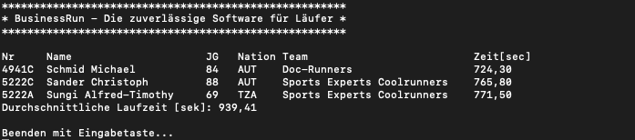

# BusinessRun

Lehrziele:

- Dateibearbeitung
- Strukturen mit Klassen
- Arrays und Listen
- Sortieren von Strukturen

## Aufgabenstellung

### Auswertung von einem Laufbwerb

In einer Datei (csv-Format) befindet sich die Ergebnisliste aus dem letzten Business-Run Rennen. Der Name dieser Datei ist „BusinessRun.csv“. Ein Datensatz (eine Zeile) ist die Beschreibung eines Laufergebnisses für jeweils einen Mitstreiter und die Detaildaten sind durch Felder beschrieben. Diese Felder sind durch ein Semikolon ';' voneinander getrennt.

Im ersten Feld steht die eindeutige Startnummer (Stnr) des Teilnehmers. Das zweite Feld beinhaltet den Namen, das dritte Feld kennzeichnet den Jahrgang, das vierte Feld führt die Nation, das fünfte Feld ist die Firma, das sechste Feld ist das Team und im letzten Feld ist die Laufzeit (im Format mm:ss,z) des entsprechenden Teilnehmers.

Folgender Beispielsatz zeigt den Aufbau eines Satzes:

*Beispiel:*

```text
517A;Auer Christoph;79;AUT;Robert Bosch AG;CRIN-Runners;15:20,9;920,9

517A.............   ist Startnummer
Auer Christop.....  ist der Name des Teilnehmers
79................  ist der Jahrgang
AUT...............  ist die Nation
Robert Bosch AG...  ist die Firma
CRIN-Runners.....   ist das Team
15:20,9...........  ist die Laufzeit 15min, 20sec und 9 Zehntelsek.
```

Nun ist es Ihre Aufgabe ein Programm zu schreiben, welches die Datei „BusinessRun.csv“ einliest und die Daten analysiert. Aus den Daten sollen folgende Informationen ermittelt werden:

- der erste Kandidat (NR;Name;JG;Nation;Team;Zeit[sek])
- der zweie Kandidat (NR;Name;JG;Nation;Team;Zeit[sek])
- der dritte Kandidat (NR;Name;JG;Nation;Team;Zeit[sek])
- die durchschnittliche Laufzeit (Sekunden)  aller Teilnehmer

Die Ausgabe sieht wie folgt aus:



**Spezialistenaufgabe:**

Sortieren Sie die Daten (nach Startnummer) und schreiben Sie anschließend das Ergebnis in die Datei „RUN-Start.csv“.
