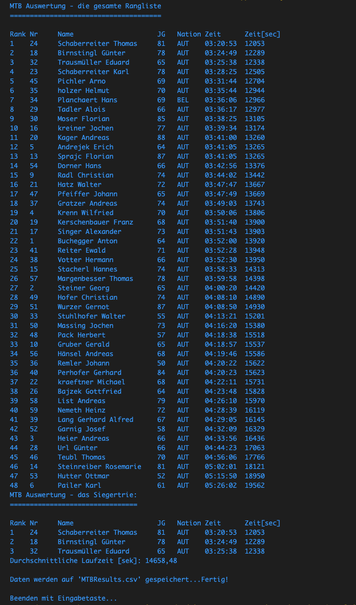

# MTB-Marathon

Lehrziele:

- Dateibearbeitung
- Strukturen mit Klassen
- Arrays und Listen
- Sortieren von Strukturen

In  einer  Datei  (csv-Format) befindet  sich  die  Ergebnisliste  aus  dem letzten MTB-Marathon Rennen. Der Name dieser Datei ist „***MTB-Marathon.csv***“. Sie finden diese Datei auf dem Angabenlaufwerk. Ein Datensatz (eine Zeile) ist die Beschreibung eines Rennergebnisses für jeweils einen Mitstreiter und die Detaildaten sind durch Felder beschrieben. Diese Felder sind durch ein Semikolon (;) voneinander getrennt.

Im ersten Feld steht die eindeutige Startnummer (Stnr) des Teilnehmers. Das zweite Feld beinhaltet den Namen, das dritte Feld kennzeichnet den Jahrgang, das vierte Feld ist die Nation und das fünfte Feld ist die Rennzeit (im Format hh:mm:ss) des entsprechenden Teilnehmers.

Folgender Beispielsatz zeigt den Aufbau eines Satzes:

*Beispiel:*

```text
5;Andrejek Erich;64;AUT;03:41:05;13265
5................  ist Startnummer
Andrejek Erich...  ist der Name des Teilnehmers
64...............  ist der Jahrgang
AUT..............  ist die Nation
03:41:05.........  ist die Rennzeit im Format hh:mm:ss
```

Nun ist es Ihre Aufgabe ein Programm zu schreiben, welches die Datei „MTBMarathon.csv“ in ein Array einliest und die Daten analysiert. Die Ergebnisse sollen nach Rennzeit aufsteigend sortiert werden, um daraus eine Rangliste zu erstellen. Achten Sie dabei auch auf ex-aequo-Platzierungen.

Erstellen Sie eine Datenkapsel ***Racer*** mit allen benötigten Eigenschaften (Properties).

Konsolenausgabe:

- Rangliste: Geben Sie die Ergebnisse nach Rennzeit aufsteigend sortiert aus (Rang – Startnummer – Name – Zeit – Zeit in Sekunden). **Achten Sie dabei auch auf ex-aequo-Platzierungen!**
- Die ersten Drei: Geben Sie nur die drei Bestplatzierten auf die Konsole aus (Rang – Startnummer – Name – Zeit – Zeit in Sekunden).
- Geben Sie die durchschnittliche Rennzeit sowohl in Sekunden als auch im Zeitformat hh:mm:ss,mm ausgegeben werden.
- Geben Sie alle Nationen, die an diesem Rennen teilgenommen haben aus.
- Ergebnisdatei: Am Ende des Programms ist die komplette Rangliste mit allen vorhandenen Daten (Rang, Startnummer, Name, Jahrgang, Land, Zeit und Zeit in Sekunden) in eine Datei namens ***MTB- Results.csv*** auszugeben.

Folgende Methoden und Funktionen sollen implementiert werden:

- static Racer[] ReadRacersFromCsv()              // liest Daten von einer csv-Datei ein
- static void SortRacersByTime(Racer[] racers)  // Sortiert resultList nach Zeit der Biker
- static void SetTimeBySeconds(Racer[] racers)  // Setzt die Zeit in Sekunden
- static void PrintRacers(Racer[] racers)       // Gibt die Biker am Bildschirm aus
- static Race[] GetFirstThreeBiker(Racer[] racers) // Ermittelt die ersten 3 Biker
- static double CalculateAverageTime(Racer[] racers) // Durchschnitt über alle Rennzeiten
- static void WriteRacersToFile(string fileName, Racer[] racers)     // Schreibt die Daten in die angegebene Datei

// Daten auf csv schreiben

Bei der Konsolenausgabe orientieren Sie sich bitte an folgendem Beispiel:



Viel Glück!
