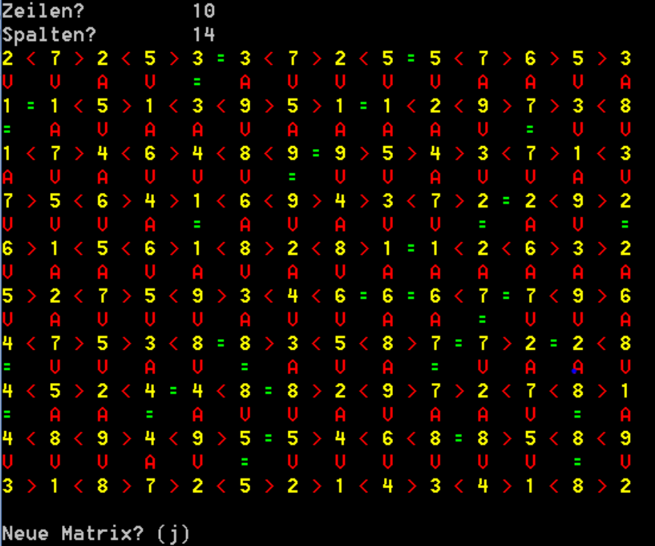

# POSE 3ABIF/3AKIF

## Matrix-Vergleich

Lernziele

- Zugriff auf Werte einer zweidimensionalen Matrix
- Methoden

### Aufgabenstellung

Schreiben Sie ein Programm ***Matrix***, mit dem ein zweidimensionales Array ***beliebiger*** Größe mit ganzen Zufallszahlen zwischen 1 und 9 gefüllt wird. Anschließend sollen diese Zahlen und die Beziehungen zwischen horizontal benachbarten Zahlen mit **<**, **>** oder **=** auf den Bildschirm ausgegeben werden (siehe Screenshot, Einfärbung optional).

Definieren und Implementieren Sie dazu zumindest zwei Methoden:

- ***CreateMatrix(...)***: Diese  Methode erzeugt und befüllt  die Matrix in der gewünschten  Größe mit Zufallszahlen  zwischen 1 und 9
- ***CompareAndPrintMatrix(...)***:  Diese Methode gibt die Zahlen  der Matrix und die  Vergleichsoperatoren zwischen  diesen Zahlen auf die Konsole

  aus.

**Zusatzaufgabe:**

Geben Sie zusätzlich zu den horizontalen Beziehungen auch die  Beziehungen zwischen übereinander liegenden Zahlen mit  „**A**“, „**V**“ oder „**=**“ aus!

