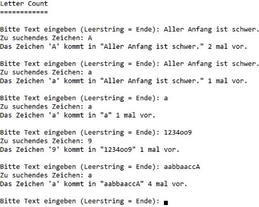
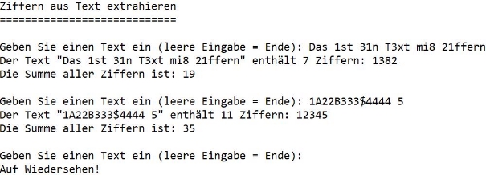

# 1BHIF   Test 01, WS 20/21 

**Hinweis: Es dür     fen keine String Standard-Methoden verwendet werden (außer Length)!!** 

**Letter Count (20)** 

Lehrziele: 

- Strings, Schleifen 

Es wird ein String und ein einzelnes Zeichen eingelesen. Das Programm berechnet, wie oft das einge- geben Zeichen in dem String auftritt. Zwischen Groß- und Kleinschreibung WIRD UNTERSCHIEDEN (also ‘a‘ != ‘A‘) Orientieren Sie sich bei der Ausgabe an der Musterausgabe:  

**Delete Characters (30)** 

Lehrziele: 

- Strings, Schleifen 

Schreiben Sie ein Programm, welches vom Benutzer einen beliebigen Text einliest. Eine zweite Zeichenfolge enthält alle Zeichen, die aus dem ersten Text entfernt werden. Erzeugen Sie eine Zeichenfolge aus dem eingegebenen Text und eliminieren dabei alle Zeichen die in der zweiten Zeichenfolge enthalten sind. 

Hinweis: Benutzereingaben dürfen im ganzen Programm nicht verändert werden und müssen erhalten bleiben. Zwischen Groß- und Kleinschreibung WIRD UNTERSCHIEDEN. 

**Filter Numbers (50)** 

Lehrziele: 

- Strings 
- Geschachtelte Schleifen 

Ein Programm extrahiert aus dem eingegebenen Text alle Ziffern (0, 1, 2, … 9). Kommt eine Ziffer mehrfach vor, so soll die Ziffer beim String der gefundenen Ziffern nur einmal angeführt werden. **Alle** gefundenen Ziffern sollen zusammengezählt und die Summe ausgegeben werden. Orientieren Sie sich bei der Ausgabe an der Musterausgabe:  

Verwenden Sie mindestens folgende Testfälle: 

|**Eingabe** |**Ausgabe** |**Anzahl** |**Summe** |
| - | - | - | - |
|1 |1 |1 |1 |
|a |"" |0 |0 |
|12 |12 |2 |3 |
|21 |21 |2 |3 |
|Hallo! |"" |0 |0 |
|Hallo8 |8 |1 |8 |
|1Hallo8 |18 |2 |9 |
|11Hallo88 |18 |4 |18 |
|12H23a34ll5 |12345 |7 |20 |

Tipps:  

1) Im Ersten Schritt erstellen Sie nur das Grundgerüst um die Überschrift auszugeben, den Text einzulesen und bei der Eingabe eines Leerstrings (““) das Programm zu beenden. Testen Sie das sofort. 
1) Im nächsten Schritt gehen Sie die Eingabe mit einer geeigneten Schleife Zeichen für Zeichen durch und prüfen jedes Zeichen, ob es eine Ziffer ist. Falls ja, fügen Sie diese zu einem String, der alle Ziffern enthält, zusammen. Zählen Sie gleich mit, wie viele Ziffern sie gefunden haben. Wandeln Sie die gefundene Ziffer in eine Zahl um und summieren Sie diese auf. Testen Sie Ihr Programm, ob es alle Ziffern findet, die Anzahl der Ziffern korrekt berechnet und die Summe richtig berechnet. 
1) Im letzten Schritt überlegen Sie sich, wie Sie in dem String, der die Ziffern enthält, keine doppelten Einträge generieren. 
1) UND …, VERWENDEN SIE DEN DEBUGGER!!! 
Viel Glück!! 
