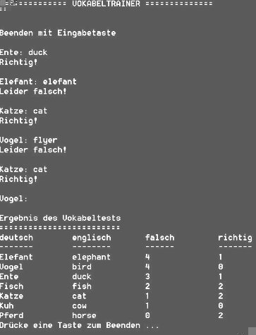

# Vokabeltrainer mit CSV-Datei

Lehrziele:

- Dateibearbeitung
- Strukturen mit Klassen
- Arrays und Listen
- Sortieren von Strukturen

## Aufgabenstellung

Es ist ein Lernspiel zu entwickeln, das auf einer CSV-Datei mit  Deutsch-Englisch-Vokabeln basiert. Die CSV-Datei besteht aus vier Spalten und einer Kopfzeile, Beispiel siehe rechts.

Ablauf

1. Zu Beginn des Lernspiels wird die Datei ***vocabulary.csv*** (aus dem Verzeichnis /bin/Debug) ausgelesen. Vergessen Sie nicht die Datei dort hinzukopieren.
1. Danach beginnt die **Lernrunde**: Ein Vokabel wird zufällig ausgewählt und dem User präsentiert. Gibt er/sie die richtige Übersetzung an, zählt das als „Hit“, eine falsche Übersetzung zählt als „Fail“. Sobald nur die Leertaste als Übersetzung gedrückt wird, endet die Lernrunde.
1. Nach der Lernrunde werden die Vokabel neu **sortiert**: Das Vokabel mit den häufigeren Fails kommt vor einem Vokabel mit weniger häufigen Fails.
1. Die sortierte Vokabelliste wird **auf die Konsole ausgegeben**.
1. Schließlich wird die Datei ***vocabulary.csv*** mit der neuen Sortierung überschrieben.

Datenkapsel: *Word*  

Schreiben Sie eine Datenkapsel (Klasse namens  ***Word***), die alle in der CSV-Datei enthaltenen  Datenwerte eines einzelnen Vokabels  speichern kann.

Methodendesign

Implementieren Sie zumindest folgende  Methoden und überlegen Sie dazu geeignete  Rückgabewerte und Parameterlisten:

- ReadWordsFromCsv
- LearningRound
- SortWordsByFails
- PrintWordsStatistics
- WriteWordsToCsv

Einseraufgabe

Wenn alles läuft, können Sie noch die  Sortierung (und die Note) verbessern, indem  Sie die Sortierreihenfolge der Vokabeln  wie  folgt ändern:

- Zuerst kommen die Vokabeln, die noch am seltensten geprüft wurden.
- Bei Vokabeln mit gleicher Prüfhäufigkeit kommt das Vokabel mit den häufigsten Fails und seltensten Hits zuerst.
- Tipp: Verpacken Sie den Vergleich zweier Vokabel in eine eigene Methode!
