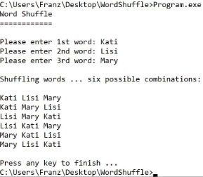

# WordShuffle

Lehrziele

- Verwendung von **string**
- Konsoleneingabe
- Konsolenausgabe

## Aufgabenstellung

Sie geben über die Konsole 3 Begriffe ein. Schreiben Sie ein Programm, das alle 6 möglichen Kombinationen dieser 3 Begriffe ausgibt.  

**Hinweise:**
Speichern Sie die drei Begriffe in drei **string**-Variablen **word1**, **word2** und **word3** ein. Geben Sie dann die Begriffe nach dem folgenden Schema aus (damit haben Sie alle Möglichkeiten abgedeckt):  

**word1** **word2** **word3**
**word1** **word3** **word2**
**word2** **word3** **word1**
**word2** **word1** **word3**
**word3** **word1** **word2**
**word3** **word2** **word1**

Beispiel: Eingabe von drei Begriffen: Kati, Lisi, Mary.

